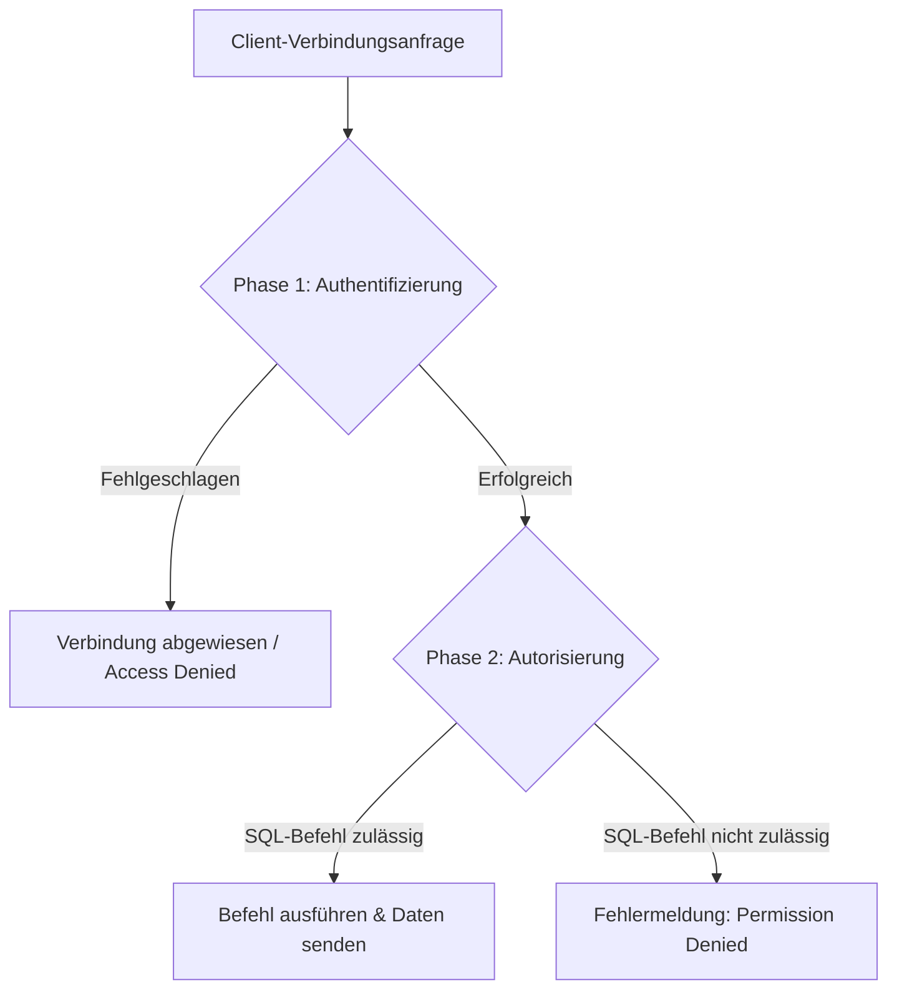
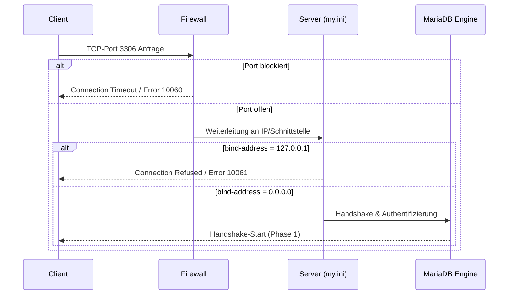

# Tag 4 – Datenbank-Sicherheit

Themen: Authentifizierung, User-Verwaltung, Remote-Zugriff, Server absichern

[← Zurück zur Übersicht](../README.md)

---

## 1. Authentifizierung – Grundlagen

Bei jedem Verbindungsaufbau prüft der MySQL/MariaDB-Server drei zentrale Sicherheitsinformationen (Triplett aus Benutzer, Passwort und Host). Erst wenn alle drei Kriterien mit einem Eintrag in den Systemtabellen übereinstimmen, wird die Verbindung zugelassen.

| Sicherheitsinformation | Bedeutung / Funktion | Standardwert / Default |
|------------------------|----------------------|------------------------|
| **Benutzername** | Identifikator des Datenbank-Benutzers. | *leer* (anonymer Benutzer) |
| **Passwort** | Nachweis der Identität. Wird serverseitig ausschliesslich als kryptografischer Hash gespeichert. | *leer* (kein Passwort erforderlich) |
| **Hostname** | Die IP-Adresse oder der Hostname des Client-Rechners, von dem die Verbindung ausgeht. | `%` (Zugriff von überall) |

### Hostname-Varianten im Detail

Das Host-Feld bestimmt präzise, von welchem physischen oder virtuellen System ein Benutzer eine Verbindung aufbauen darf. Dies ist eine der wichtigsten Sicherheitsbarrieren in SQL-Datenbanken.

| Hostname | Beschreibung & Technische Funktionsweise | Sicherheitsaspekt |
|----------|-----------------------------------------|-------------------|
| `localhost` | Der Benutzer darf sich ausschliesslich vom **Server-Rechner selbst** aus einloggen. Auf Linux wird hierbei ein lokaler Unix-Socket verwendet. Unter Windows erfolgt der Zugriff über Shared Memory oder Named Pipes. **Wichtig:** Eine TCP/IP-Verbindung auf `127.0.0.1` gilt nicht als `localhost`! | **Sehr hoch:** Keine externe Netzwerk-Angriffsfläche. |
| `%` | Wildcard für alle Hosts. Der Benutzer darf sich von **jedem beliebigen externen Rechner** über TCP/IP einloggen. **Achtung:** `localhost` wird von `%` oft nicht abgedeckt – für lokalen Socket-Zugriff ist ein separater Eintrag erforderlich. | **Gering:** Erfordert zwingend starke Passwörter und ggf. zusätzliche Firewalls. |
| `172.16.17.111` | Der Benutzer darf sich nur von dieser **einzelnen, statischen IP-Adresse** aus verbinden. | **Sehr hoch:** Ideal für die Verknüpfung dedizierter Web- oder Application-Server. |
| `172.16.17.%` | Wildcard für ein **Subnetz**. Erlaubt Verbindungen von jeder IP-Adresse, die mit `172.16.17.` beginnt (z. B. IP-Bereich einer Abteilung). | **Mittel:** Praktisch für Entwickler-Teams im gleichen Subnetz. |
| `name.local` oder `*.domain.ch` | Der Benutzer darf sich von Hostnames einloggen, die per **Reverse-DNS** aufgelöst werden können. | **Mittel:** Kann bei DNS-Ausfällen zu Login-Verzögerungen führen. Wird oft über `skip-name-resolve` deaktiviert. |

> [!NOTE]
> **TCP/IP vs. Socket (`localhost` vs. `127.0.0.1`):**
> Wenn Sie sich mit `-h localhost` verbinden, nutzt der MySQL-Client unter Unix Sockets. Wenn Sie sich mit `-h 127.0.0.1` verbinden, wird eine echte TCP/IP-Loopback-Verbindung aufgebaut. Für das DBMS sind dies zwei unterschiedliche Berechtigungskontexte!

---

### Zwei Phasen der Zugangskontrolle

Der Zugriffsschutz des DBMS ist in zwei logisch getrennte Phasen unterteilt:



1. **Phase 1: Authentifizierung (Connection Verification)**
   - **Frage:** *Wer* will sich verbinden und *von wo*? Ist die Identität korrekt nachgewiesen?
   - **Ablauf:** Der Server prüft Benutzername, Passwort-Hash und Host-IP gegen die Tabelle `mysql.user` (bzw. die View auf `mysql.global_priv`).
   - **Zusatzprüfungen:** Hier wird auch kontrolliert, ob verschlüsselte Verbindungen (SSL/TLS) vorgeschrieben sind.
2. **Phase 2: Autorisierung (Privilege Verification)**
   - **Frage:** *Was* darf der erfolgreich angemeldete Benutzer tun?
   - **Ablauf:** Bei **jedem einzelnen SQL-Befehl** (z. B. `SELECT`, `UPDATE`, `DROP`) prüft das DBMS in einer hierarchischen Reihenfolge die Rechte:
     1. Globale Ebene (`mysql.user` / `mysql.global_priv`)
     2. Datenbank-Ebene (`mysql.db`)
     3. Tabellen-Ebene (`mysql.tables_priv`)
     4. Spalten-Ebene (`mysql.columns_priv`)
     5. Routinen-Ebene (`mysql.procs_priv` für Stored Procedures)

---

## 2. User-Verwaltung

### User erstellen (DCL / DDL)

Verwenden Sie immer die explizite `CREATE USER`-Syntax. Das Erstellen von Benutzern direkt über den `GRANT`-Befehl ist in modernen MySQL/MariaDB-Versionen veraltet oder deaktiviert.

```sql
-- 1. Externer User mit Passwort (von jedem Remote-Host)
DROP USER IF EXISTS 'user_rem'@'%';
CREATE USER 'user_rem'@'%' IDENTIFIED BY 'SicheresPassw0rt123!';

-- 2. Rein lokaler User ohne Passwort (nur für interne Scripte auf dem Server)
CREATE USER 'user_local'@'localhost';

-- 3. User, der sich nur aus dem Firmen-Subnetz anmelden darf
CREATE USER 'user_corp'@'172.16.17.%' IDENTIFIED BY 'CorpPass!2026';

-- 4. User mit SSL-Pflicht erstellen
CREATE USER 'ssl_user'@'%' IDENTIFIED BY 'SecureSSLPass123!' REQUIRE SSL;
```

> [!IMPORTANT]
> Verwenden Sie für produktive Datenbanken niemals leere Passwörter oder Standard-Benutzernamen wie `admin` oder `test` für Remote-Zugriffe.

---

### Passwort setzen / ändern

Es gibt verschiedene SQL-Statements, um Passwörter zu aktualisieren. Bevorzugen Sie die moderne `ALTER USER`-Variante.

```sql
-- Modernes Standard-Verfahren (empfohlen für MySQL 5.7+ und MariaDB)
ALTER USER 'user_rem'@'%' IDENTIFIED BY 'NeuesSicheresPasswort456!';

-- Ältere Syntax (Legacy-Variante über SET PASSWORD)
SET PASSWORD FOR 'user_rem'@'%' = PASSWORD('NeuesSicheresPasswort456!');

-- Passwort-Änderung erzwingen (Benutzer muss beim nächsten Login ein neues PW setzen)
ALTER USER 'user_rem'@'%' PASSWORD EXPIRE;
```

> [!WARNING]
> **Die veraltete `PASSWORD()`-Funktion:**
> In modernen MySQL-Versionen (ab 8.0) wurde die SQL-Funktion `PASSWORD()` komplett entfernt. In MariaDB ist sie als veraltet markiert. Verwenden Sie stattdessen die direkte Deklaration über `IDENTIFIED BY 'klartext'`, da das DBMS die Hash-Berechnung automatisch und sicher im Hintergrund durchführt.

---

### Der `FLUSH PRIVILEGES`-Mythos

Ein weit verbreiteter Irrglaube ist, dass nach jedem `GRANT`, `REVOKE` oder `CREATE USER` zwingend ein `FLUSH PRIVILEGES` ausgeführt werden muss.

* **Wann ist `FLUSH PRIVILEGES` NICHT nötig?**
  Bei allen Standard-Befehlen der Benutzerverwaltung (`CREATE USER`, `ALTER USER`, `DROP USER`, `GRANT`, `REVOKE`). Diese Befehle sind sogenannte *Account Management Statements*. Der Server führt die Änderungen direkt im Speicher (In-Memory Privilege Cache) aus. Die Änderungen sind **sofort** aktiv.
* **Wann MUSS `FLUSH PRIVILEGES` ausgeführt werden?**
  Nur wenn Sie die Systemtabellen der `mysql`-Datenbank direkt mit Schreiboperationen (DML) manipulieren, wie z. B.:
  ```sql
  UPDATE mysql.user SET authentication_string = PASSWORD('xyz') WHERE User = 'root';
  FLUSH PRIVILEGES; -- Zwingend erforderlich, da das DBMS die Tabellenänderung sonst nicht mitbekommt!
  ```

---

### Passwort-Hash manuell ermitteln (MariaDB)

Falls Sie in einem SQL-Installationsskript kein Klartextpasswort hinterlassen möchten, können Sie den Hashwert vordefinieren.

```sql
-- Generieren des SHA1-basierten Hashes (in älteren MariaDB-Versionen)
SELECT PASSWORD('MeinGeheimesPasswort');
-- Ausgabe z. B.: *6C8EC8B227B132C7D6437946EF945415BDADEC4D

-- Erstellen des Users direkt mit dem Hashwert
CREATE USER 'user_hashed'@'%' IDENTIFIED VIA mysql_native_password USING '*6C8EC8B227B132C7D6437946EF945415BDADEC4D';
```

---

### User löschen und anzeigen

```sql
-- User sauber entfernen (löscht auch automatisch alle vergebenen Rechte des Users)
DROP USER 'user_rem'@'%';
FLUSH PRIVILEGES; -- Nur zur Sicherheit, falls noch alte Tabellenfragmente existieren

-- Alle aktiven Benutzerkonten und deren erlaubte Hosts auflisten
SELECT User, Host, plugin, authentication_string FROM mysql.user;
```

---

## 3. Remote-Zugriff

Um erfolgreich von einem Client auf einen entfernten MySQL/MariaDB-Server zuzugreifen, müssen drei Hürden genommen werden:
1. **Das DBMS** muss auf externen Netzwerkschnittstellen lauschen.
2. **Die Firewall** des Server-Betriebssystems muss den Port freigeben.
3. **Der DB-User** muss für den externen Host autorisiert sein.



### a) Server-Konfiguration anpassen (`my.ini` / `my.cnf`)

Standardmässig lauscht MySQL/MariaDB nach der Installation nur auf `127.0.0.1` (Localhost). Damit Verbindungen aus dem LAN/WLAN akzeptiert werden, muss die Konfigurationsdatei angepasst werden:

1. Öffnen Sie die Konfigurationsdatei (unter XAMPP: `C:\xampp\mysql\bin\my.ini`).
2. Suchen Sie nach dem Block `[mysqld]`.
3. Ändern oder ergänzen Sie die Zeile `bind-address`:
   ```ini
   [mysqld]
   # 127.0.0.1 = Nur lokale Verbindungen zulassen (Standard)
   # 0.0.0.0   = Auf ALLEN verfügbaren Netzwerkschnittstellen lauschen
   bind-address = 0.0.0.0
   ```
4. Starten Sie den MySQL-Dienst über das XAMPP Control-Panel oder die Windows-Dienste neu.

---

### b) Verbindung testen (Diagnose-Leitfaden)

Wenn die Verbindung fehlschlägt, prüfen Sie die Fehlerursache systematisch von Schicht 3 bis Schicht 7:

#### Schritt 1: Netzwerk-Ping (Schicht 3 - ICMP)
Prüft, ob der Server-Rechner im Netzwerk überhaupt erreichbar ist.
```cmd
ping 172.16.17.4
```
*Fehlgeschlagen?* Netzwerkkabel, IP-Konfiguration oder ICMP-Blockade in der Firewall prüfen.

#### Schritt 2: Port-Scan (Schicht 4 - TCP)
Prüft, ob der Port `3306` auf dem Server offen ist und nicht durch eine Firewall blockiert wird.
* **Windows (PowerShell):**
  ```powershell
  Test-NetConnection -ComputerName 172.16.17.4 -Port 3306
  ```
  *(Suchen Sie in der Ausgabe nach `TcpTestSucceeded : True`)*
* **Linux / Mac / Windows (Telnet):**
  ```cmd
  telnet 172.16.17.4 3306
  ```
*Fehlgeschlagen?* Windows-Firewall auf dem Server kontrollieren und eine eingehende Regel für TCP-Port 3306 erstellen.

#### Schritt 3: Dienst-Prüfung (Schicht 7 - Applikation)
Prüfen, ob der MySQL-Server reagiert und bereit ist, Verbindungen anzunehmen.
```cmd
-- Einfacher Ping an den Dienst (ohne Benutzer-Login)
mysqladmin -h 172.16.17.4 ping

-- Ping mit Benutzerauthentifizierung
mysqladmin -h 172.16.17.4 -u user_rem -p ping
```
*Erwartete Ausgabe:* `mysqld is alive`

---

### c) Remote-Verbindung aufbauen

Verbinden Sie sich interaktiv über die Kommandozeile mit dem entfernten Server:

```cmd
mysql -h 172.16.17.4 -u user_rem -p
```

Überprüfen Sie nach dem Login den Verbindungsstatus:
```sql
status;
-- Zeigt wichtige Infos wie: "Connection: 172.16.17.4 via TCP/IP" sowie den aktuellen Benutzer.
```

---

### d) Backup & Restore über das Netzwerk

Nutzen Sie `mysqldump` für die Datensicherung über Netzwerkgrenzen hinweg.

```cmd
-- BACKUP: Schreibt die Tabellenstruktur und Daten in eine lokale SQL-Datei
mysqldump -h 172.16.17.4 -u user_rem -p --single-transaction --quick --databases firma > C:\temp\backup_firma.sql

-- RESTORE: Liest eine lokale SQL-Datei ein und führt sie auf dem Remote-Server aus
mysql -h 172.16.17.4 -u user_rem -p firma < C:\temp\backup_firma.sql
```

> [!TIP]
> **Performance-Tipp für Dumps:**
> Der Parameter `--single-transaction` verhindert das Sperren von InnoDB-Tabellen während des Backups. `--quick` sorgt dafür, dass Zeilen direkt auf die Festplatte geschrieben werden, statt sie im RAM zwischenzuspeichern, was den Server schont.

---

### e) Netzwerkzugriff vollständig sperren (`skip-networking`)

Wenn die Datenbank ausschliesslich von Anwendungen genutzt wird, die auf demselben physikalischen Server laufen (z. B. eine lokale Web-Applikation auf XAMPP), sollte der Netzwerkzugriff aus Sicherheitsgründen komplett abgeschaltet werden.

Tragen Sie dazu in der `my.ini` unter `[mysqld]` ein:
```ini
[mysqld]
skip-networking
```

**Auswirkung:**
Der Server öffnet keinen TCP/IP-Port (3306) mehr. Externe Angriffe über das Netzwerk auf das DBMS sind damit physikalisch unmöglich. Lokale Verbindungen auf Linux funktionieren weiterhin über Unix-Sockets, auf Windows über Named Pipes oder Shared Memory.

---

## 4. Server absichern

Ein frisch installierter MySQL/MariaDB-Server (insbesondere unter XAMPP) ist standardmässig unsicher konfiguriert (leeres root-Passwort, anonyme Benutzer, Testdatenbank für jeden beschreibbar). Diese Schwachstellen müssen umgehend behoben werden.

### Das Standard-Tool: `mysql_secure_installation`

Auf Linux-Systemen und Standard-Installationen existiert ein interaktives Shell-Skript, das die wichtigsten Härtungsschritte automatisch durchführt. Führen Sie dieses nach jeder Neuinstallation aus:
```bash
mysql_secure_installation
```
Das Tool führt Sie durch folgende Schritte:
1. **root-Passwort setzen/ändern** (Standardmässig ist dieses leer).
2. **Anonyme Benutzer entfernen** (Löscht Accounts ohne Namen, z. B. `''@'localhost'`).
3. **root-Login von extern verbieten** (Verhindert, dass sich root über das Netzwerk anmeldet).
4. **Testdatenbank löschen** (Entfernt die für jedermann zugängliche `test`-Datenbank).
5. **Rechte-Tabellen neu laden** (Aktiviert alle Änderungen sofort).

---

### Manuelle Härtungsschritte via SQL

Falls das automatisierte Skript nicht zur Verfügung steht (z. B. unter Windows/XAMPP), können Sie die Befehle manuell ausführen:

#### 1. root-Passwort für alle lokalen Host-Varianten setzen
```sql
-- Root-Passwort für localhost setzen
ALTER USER 'root'@'localhost' IDENTIFIED BY 'SuperSicheresAdminPasswort2026!';

-- Root-Passwort für 127.0.0.1 (TCP-Loopback) setzen
ALTER USER 'root'@'127.0.0.1' IDENTIFIED BY 'SuperSicheresAdminPasswort2026!';

-- Root-Passwort für IPv6-Loopback (::1) setzen
ALTER USER 'root'@'::1' IDENTIFIED BY 'SuperSicheresAdminPasswort2026!';

FLUSH PRIVILEGES;
```

#### 2. Root-Zugriff aus dem Netzwerk sperren
Der Administrator-Account `root` sollte sich niemals aus dem Netzwerk anmelden dürfen.
```sql
-- Prüfen, ob ein root-Eintrag für externe Hosts existiert
SELECT User, Host FROM mysql.user WHERE User = 'root';

-- Falls vorhanden, den externen Root-User löschen
DROP USER IF EXISTS 'root'@'%';
FLUSH PRIVILEGES;
```

#### 3. Anonyme Benutzer und Testdatenbank löschen
Anonyme Konten erlauben Verbindungen ohne explizite Angabe eines Benutzernamens, was Angreifern das Ausspähen erleichtert.
```sql
-- Anonyme Konten löschen
DROP USER IF EXISTS ''@'localhost';
DROP USER IF EXISTS ''@'%';

-- Testdatenbank löschen
DROP DATABASE IF EXISTS test;
FLUSH PRIVILEGES;
```

---

### phpMyAdmin-Konfiguration absichern

Die Weboberfläche phpMyAdmin ist ein beliebtes Ziel für Brute-Force-Angriffe. Passen Sie die Konfiguration in `C:\xampp\phpMyAdmin\config.inc.php` an:

```php
// UNSICHER: 'config'-Modus (Passwort steht im Klartext in der Konfigurationsdatei)
// phpMyAdmin loggt sich automatisch ein, ohne nachzufragen.
$cfg['Servers'][$i]['auth_type'] = 'config';
$cfg['Servers'][$i]['user'] = 'root';
$cfg['Servers'][$i]['password'] = 'SuperSicheresAdminPasswort2026!';

// SICHER: 'cookie'-Modus (Empfohlen)
// Es erscheint eine grafische Login-Maske im Browser. Das Passwort wird im Speicher gehalten.
$cfg['Servers'][$i]['auth_type'] = 'cookie';

// WICHTIG bei 'cookie': Ein starkes Blowfish-Secret zur Verschlüsselung der Cookies setzen
$cfg['blowfish_secret'] = '32_zeichen_langer_zufaelliger_schluessel_hier_eintragen!';
```

---

## 5. Checkpoint-Fragen

### Welche drei Informationen prüft MySQL bei der Authentifizierung?
1. **Benutzername** (Wer meldet sich an?)
2. **Passwort-Hash** (Kann die Identität per Passwort nachgewiesen werden?)
3. **Hostname / IP-Adresse** (Von welchem Gerät im Netzwerk kommt die Anfrage?)

---

### Was bedeutet Hostname `%` bei einem MySQL-User?
Der Benutzer darf sich von **jedem beliebigen externen Rechner** im Netzwerk anmelden. Lokale Verbindungen via Unix-Socket (`localhost`) sind darin standardmässig nicht enthalten und müssen separat berechtigt werden.

---

### Was ist der Unterschied zwischen Authentifizierung und Autorisierung?
* **Authentifizierung (Phase 1):** Findet beim Verbindungsaufbau statt. Prüft, ob Benutzername, Passwort und Host übereinstimmen.
* **Autorisierung (Phase 2):** Findet bei jedem abgesetzten SQL-Befehl statt. Prüft anhand der Rechte-Tabellen, ob der Benutzer die Aktion (z. B. `DELETE`) auf dem Zielobjekt ausführen darf.

---

### Warum muss nach Passwort-Änderungen manchmal `FLUSH PRIVILEGES` ausgeführt werden und wann nicht?
* **Nicht nötig:** Wenn die Änderung über Account-Management-Befehle wie `ALTER USER`, `CREATE USER` oder `GRANT` erfolgt. Hier aktualisiert das DBMS den Cache automatisch.
* **Nötig:** Wenn die Tabellen in der Datenbank `mysql` direkt per `UPDATE` oder `INSERT` manipuliert werden. Ohne `FLUSH PRIVILEGES` liest das DBMS die Änderungen erst nach einem Server-Neustart ein.

---

### Wie wird ein Passwort in MySQL/MariaDB gespeichert?
Niemals im Klartext. Es wird als kryptografischer Hash (SHA1-basiert bei `mysql_native_password` oder SHA256-basiert bei modernen Triebwerken) gespeichert. Der Hashwert wird in der Tabelle `mysql.user` im Feld `authentication_string` abgelegt und beginnt klassischerweise mit einem `*`.

---

### Was bewirkt `skip-networking` in der `my.ini`?
Es deaktiviert sämtliche TCP/IP-Netzwerkverbindungen des MySQL-Servers. Der Port 3306 wird nicht geöffnet. Lokale Verbindungen über Sockets (Linux) oder Pipes/Shared Memory (Windows) bleiben aktiv. Dies schützt den Server vor jeglichen Angriffen aus dem Netzwerk.

---

### Welche Systemtabellen in der `mysql`-Datenbank steuern die Zugriffsrechte?
* `mysql.global_priv` (bzw. die View `mysql.user`): Globale Berechtigungen und Verbindungsdaten.
* `mysql.db`: Rechte bezogen auf gesamte Datenbanken (z. B. `GRANT SELECT ON db_name.*`).
* `mysql.tables_priv`: Rechte auf Tabellenebene.
* `mysql.columns_priv`: Feingranulare Rechte auf Spaltenebene.
* `mysql.procs_priv`: Rechte für Stored Procedures und Functions.

---

### Wie testet man, ob der MySQL-Server auf einem Remote-Host läuft?
Mit dem Dienst-Diagnosetool `mysqladmin`:
```cmd
mysqladmin -h 172.16.17.4 -u user_rem -p ping
```
Antwortet der Server mit `mysqld is alive`, läuft der Dienst und die Verbindung steht.

---

### Welche Massnahmen sichern einen MySQL-Server nach der Installation ab?
1. **root-Passwort setzen** für alle lokalen Host-Varianten (`localhost`, `127.0.0.1`, `::1`).
2. **Externen root-Zugriff entfernen** (Löschen von `root`@`%`).
3. **Anonyme Benutzerkonten löschen** (`DROP USER ''@'localhost'`).
4. **Standard-Testdatenbank löschen** (`DROP DATABASE test`).
5. **Netzwerkzugriff einschränken** (`bind-address = 127.0.0.1` oder `skip-networking`, falls kein Remotezugriff benötigt wird).
6. **phpMyAdmin-Login sichern** (`auth_type = 'cookie'`).

---

### In welchen Fällen ist das temporäre Sperren des Netzwerkzugriffs sinnvoll?
* **Wartungsfenster:** Einspielen von Updates, Schema-Migrationen oder Datenbereinigungen, ohne dass Benutzer parallel Daten manipulieren.
* **Sicherheitsvorfälle:** Trennen des Servers vom Netz bei Verdacht auf Kompromittierung oder unbefugten Zugriff.
* **Konsistente Backups:** Erstellen eines physischen Datenbank-Backups, währenddessen keine Schreibzugriffe stattfinden dürfen.

---

## 6. Checkpoint – DB-Server im LAN

### 1. Welcher Befehl testet die Verbindung zum Server-Rechner mit Adresse 139.79.124.97?
* [ ] `mysql -h 139.79.124.97`
* [ ] `ipconfig`
* [x] `ping 139.79.124.97`
* [x] `mysqladmin -h 139.79.124.97 -u root -p ping`

> **Erklärung:**
> `ping 139.79.124.97` testet die Erreichbarkeit auf Netzwerkebene (Schicht 3). `mysqladmin ... ping` prüft, ob der MySQL-Dienst auf diesem Port antwortet (Schicht 7). Der Befehl `mysql -h ...` ist ein interaktiver Verbindungsversuch und kein reiner Testbefehl. `ipconfig` zeigt die eigene IP-Konfiguration an, nicht die des Servers.

---

### 2. Wozu wird der Parameter `-h` bei MySQL verwendet?
* [ ] bewirkt die Abfrage des Passworts
* [ ] bewirkt die Verbindung als bestimmter Benutzer
* [ ] Angabe der Adresse des Client-Rechners
* [x] Angabe der Adresse des Server-Rechners

> **Erklärung:**
> `-h` steht für **Host** (Server-Rechner). Es teilt dem Client mit, zu welcher IP-Adresse oder zu welchem Hostname er die Verbindung aufbauen soll. Für den Benutzer wird `-u` (User) und für das Passwort `-p` (Password) verwendet.

---

### 3. Was bewirkt der Befehl `mysqldump -h 139.79.124.97 hotel > datei.txt`?
* [ ] Backup der DB hotel in die Datei datei.txt auf Adresse 139.79.124.97
* [x] Backup der angegebenen DB auf dem Server mit der IP-Adresse 139.79.124.97
* [ ] Restore der Datenbank hotel auf dem Server mit der Adresse 139.79.124.97
* [ ] Ausführen des SQL-Skripts datei.txt auf Adresse 139.79.124.97 auf die DB hotel

> **Erklärung:**
> `mysqldump` zieht ein Backup der angegebenen Remote-Datenbank (`hotel`). Das Grösser-als-Zeichen (`>`) leitet die Ausgabe in eine lokale Textdatei namens `datei.txt` auf dem Client-Rechner um. Es ist kein Restore (dafür müsste `<` verwendet werden) und die Datei wird lokal gespeichert, nicht auf dem Remote-Server.

---

### 4. Welche Aufgabe hat der ODBC-Driver?
* [x] passt die SQL-Befehle dem entsprechenden DB-Server an
* [ ] ermöglicht das Erstellen und Konfigurieren von ODBC-Datenquellen (DSN)
* [x] ermöglicht den einheitlichen Zugriff einer Applikation auf verschiedene Datenbanken
* [ ] ermöglicht den Zugriff einer Applikation auf eine bestimmte DB

> **Erklärung:**
> ODBC (Open Database Connectivity) ist eine standardisierte Datenbankschnittstelle. Der Treiber (Driver) übersetzt standardisierte ODBC-Aufrufe der Applikation in das spezifische Protokoll und die SQL-Dialekte der Zieldatenbank (z. B. MariaDB). Das Einrichten von DSNs geschieht über das Betriebssystem-Tool (ODBC-Datenquellen-Administrator), nicht durch den Treiber selbst.

---

### 5. Wie greifen Sie vom Konsolenfenster auf einen DB-Server mit Adresse 139.79.124.97 zu?
* [ ] `mysqladmin -h 139.79.124.97`
* [ ] `mysql -h 139.79.124.97 hotel < hotel.bkp`
* [x] `mysql -h 139.79.124.97 -u root -p`
* [ ] `ping 139.79.124.97`

> **Erklärung:**
> Um eine interaktive Konsole zu öffnen, verwendet man das Client-Programm `mysql` mit Host (`-h`), Benutzer (`-u`) und Passwortabfrage (`-p`). `mysqladmin` ist für administrative Einzelbefehle gedacht. `< hotel.bkp` führt einen nicht-interaktiven Restore durch. `ping` arbeitet auf Netzwerkebene und startet keine DB-Sitzung.

---

### 6. Welche Aufgaben hat der DB-Server im Gegensatz zum DB-Client?

| DB-Server | DB-Client |
|-----------|-----------|
| **Speichert die eigentlichen Daten** sicher auf der Festplatte. | **Stellt dem Benutzer ein Interface bereit** (GUI/CLI). |
| **Verarbeitet SQL-Anfragen** und optimiert den Ausführungsplan. | **Sendet SQL-Befehle** über das Netzwerk an den Server. |
| **Verwaltet Benutzer und Zugriffsrechte** (Authentifizierung/Autorisierung). | **Empfängt und formatiert die Ergebnisse** für den Benutzer. |
| **Gewährleistet Datenkonsistenz und -integrität** (z. B. Fremdschlüsselprüfung). | Hat selbst **keine Daten** lokal gespeichert. |
| **Transaktionsmanagement** (ACID, Locks gegen Race Conditions). | Kann grafisch (Workbench, phpMyAdmin) oder textbasiert (`mysql.exe`) sein. |

---

### 7. Weshalb benutzt man MS Access z.B. zusammen mit einem MySQL-Server?
MS Access glänzt als **Frontend-Entwicklungstool** (einfache Erstellung von grafischen Oberflächen, Berichten und Formularen für Endbenutzer). MySQL/MariaDB hingegen ist als **Backend-Server** extrem stabil, performant, unterstützt echte Mehrbenutzerumgebungen und grosse Datenmengen.
Durch die Kopplung via ODBC nutzt man das Beste aus beiden Welten: Access für die einfache Benutzeroberfläche und MySQL für die sichere und performante Datenhaltung im Netzwerk.

---

### 8. Wie bestimmen Sie die IP-Adresse des Server-Rechners?
* **Auf dem Server selbst (Windows):**
  ```cmd
  ipconfig
  -- Oder filtriert:
  ipconfig | findstr IPv4
  ```
* **Auf dem Server selbst (Linux):**
  ```bash
  ip addr show
  ```
* **Aus dem MySQL-Client heraus:**
  ```sql
  SHOW VARIABLES LIKE 'hostname';
  ```

---

### 9. Wie prüfen Sie, ob der DB-Server auf Adresse 139.79.124.97 läuft?
Führen Sie vom Client-Rechner aus folgenden administrative Testbefehl aus:
```cmd
mysqladmin -h 139.79.124.97 -u root -p ping
```
* **Bei Erfolg:** Ausgabe von `mysqld is alive`.
* **Bei Misserfolg:** Fehlermeldung wie `Can't connect to MySQL server on '139.79.124.97' (10061)`.

---

### 10. Welcher Befehl führt das SQL-Skript `xy.sql` auf die DB `hotel` auf Adresse 139.79.124.97 aus?
```cmd
mysql -h 139.79.124.97 -u root -p hotel < xy.sql
```
Das Kleiner-als-Zeichen (`<`) liest den Inhalt der lokalen Datei `xy.sql` ein und sendet die darin enthaltenen Befehle nacheinander an die Datenbank `hotel` auf dem Remote-Server.
