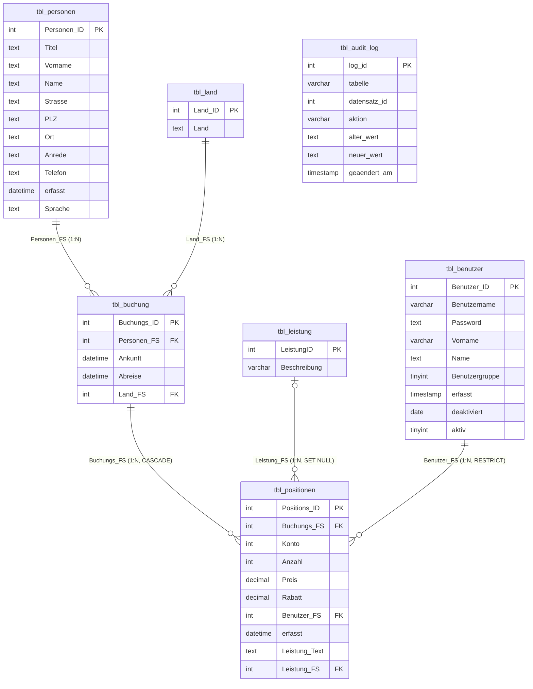

# LB3 – Backpacker Praxisarbeit

Lernportfolio von **Noah Bachmann** – TBZ Zürich M141, 2025/2026

[← Zurück zur Übersicht](../README.md)

> **Projektszenario:**
> Eine Jugendherberge migriert ihre historisch gewachsene und instabile MS-Access-Datenbank „Backpacker“ auf eine moderne relationale SQL-Architektur. Das System wird zunächst lokal auf MariaDB (XAMPP) optimiert, bereinigt, mit Geschäftslogik (Views, Trigger, Stored Procedures) ausgestattet und anschliessend verschlüsselt auf eine verwaltete Cloud-Instanz (AWS RDS MySQL 8.0) migriert.

---

## Scripts-Übersicht

Die gesamte Implementierung und Migration ist in sieben modular aufgebauten SQL- und PowerShell-Dateien organisiert:

| Script | Dateiname | Zweck / Inhalt |
|:-:|-----------|----------------|
| **1** | [01_backpacker_ddl.sql](./01_backpacker_ddl.sql) | **DDL:** Erstellt das physische Schema `backpacker_noah_lb3` unter InnoDB, inkl. Primär- und Fremdschlüssel-Constraints, CHECK-Constraints und der Struktur des Audit-Logs. |
| **2** | [02_backpacker_dcl.sql](./02_backpacker_dcl.sql) | **DCL:** Erstellt die Sicherheitsrollen (`benutzer_rolle`, `management_rolle`), konfiguriert Spalten-Grants (Column-level security) und legt die Anwender-Accounts an. |
| **3** | [03_backpacker_import.sql](./03_backpacker_import.sql) | **DML / Import:** Führt den Rohdaten-Import via `LOAD DATA INFILE` aus, bereinigt Waisen (Referenzfehler) und hasht Altsystem-Klartextpasswörter mit SHA-256. |
| **4** | [04_backpacker_test.sql](./04_backpacker_test.sql) | **Testing:** Lokales Testprotokoll zur automatisierten Validierung der Berechtigungen, Trigger, Views und Datenkonsistenz. |
| **5** | [05_backpacker_migration.sql](./05_backpacker_migration.sql) | **Migration:** Dokumentiert die Befehlsfolgen für das Backup (Hot-Backup) und den Restore auf die AWS-Cloud. |
| **6** | [06_backpacker_cloud_test.sql](./06_backpacker_cloud_test.sql) | **Testing (Cloud):** Cloud-Testprotokoll zur Verifizierung der erfolgreichen Datenmigration, der SSL/TLS-Verschlüsselung und der Performance. |
| **7** | [07_backpacker_views_proc.sql](./07_backpacker_views_proc.sql) | **Programmierung:** Erstellt Views, Stored Procedures, benutzerdefinierte Funktionen (UDF) und Trigger. |

### Ausführungsreihenfolge (Lokale Installation)
Führen Sie die Skripte in der Eingabeaufforderung (CMD) im Projektverzeichnis aus:
```cmd
-- 1. Schema & Tabellenstrukturen erstellen (als root)
mysql -u root -p < 01_backpacker_ddl.sql

-- 2. Berechtigungen, Rollen und Benutzer anlegen (als root)
mysql -u root -p < 02_backpacker_dcl.sql

-- 3. CSV-Import, Datenbereinigung & Hashing (erfordert --local-infile)
mysql --local-infile=1 -u root -p backpacker_noah_lb3 < 03_backpacker_import.sql

-- 4. Programmierlogik (Views, Trigger, Stored Procedures) einspielen
mysql -u root -p backpacker_noah_lb3 < 07_backpacker_views_proc.sql

-- 5. Lokales Testskript starten und Ausgaben verifizieren
mysql -u root -p backpacker_noah_lb3 < 04_backpacker_test.sql
```

---

## MS A – Definition Infrastruktur

### Anforderungsdefinition (SMART)

*   **S - Spezifisch:** Die bestehende Access-Datenbank wird in ein relationales SQL-Schema migriert. Lokales Zielsystem ist MariaDB (XAMPP). Cloud-Zielsystem ist eine verwaltete Instanz unter AWS RDS (MySQL 8.0). Benutzerrechte werden strikt nach dem Least-Privilege-Prinzip über zwei Rollen getrennt. Sensible Spalten der Benutzertabelle (Passwörter) werden gesperrt.
*   **M - Messbar:**
    *   Erfolgreicher Import aller 6 Kern-Tabellen.
    *   Überprüfung der Datenkonsistenz: Zeilenzahlen müssen lokal und in der Cloud exakt übereinstimmen.
    *   100 % Erfolgsquote bei den 40 definierten Loke-Tests (Rechte, Constraints, Trigger) und den 20 Cloud-Tests.
    *   Sichere SSL-Verbindungen (erzwungen) auf AWS RDS.
*   **A - Akzeptiert:** Das Projekt entspricht den Richtlinien des TBZ-Moduls M141 und wird anhand des offiziellen Punkterasters (max. 40 Punkte) bewertet.
*   **R - Realistisch:** Einzelarbeit im Zeitrahmen von 9–12 Präsenzlektionen plus kontrollierte Heimarbeit. Die verwendete Infrastruktur (XAMPP, AWS Starter-Account, MySQL Workbench) steht kostenfrei zur Verfügung.
*   **T - Terminiert:**
    *   *Meilenstein A (Infrastruktur):* Tag 8
    *   *Meilenstein B (Lokale DB):* Tag 9
    *   *Meilenstein C/D (Migration, Cloud & Demo):* Tag 10

---

### Evaluation Cloud-RDBMS

Für die Migration der lokalen Datenbank in die Cloud wurden drei führende, verwaltete Datenbankdienste (PaaS) evaluiert:

| Kriterium | AWS RDS (MySQL 8.0) | Google Cloud SQL | Azure Database for MySQL |
|-----------|:-------------------:|:----------------:|:------------------------:|
| **Managed Backup / Updates** | **Sehr gut** (automatisiert) | Gut | Gut |
| **Sicherheits-Features** | **Sehr gut** (VPC, IAM, SSL-Pflicht) | Gut (IAM-Integration) | Gut |
| **Kostenstruktur / Free Tier** | **Hervorragend** (12 Monate free t2.micro, 20 GB) | Eingeschränkt (Startguthaben) | Keine kostenlose Stufe |
| **SSL/TLS-Verschlüsselung** | **Einfach erzwingbar** (Parameter Group) | Ja (Zertifikate nötig) | Ja |
| **Lernressourcen / TBZ** | **Sehr hoch** (Dokumentation vorhanden) | Gering | Mittel |

#### Entscheid: AWS RDS (Engine: MySQL 8.0)
*   **Begründung:** Bietet ein stabiles kostenloses Kontingent (*Free Tier* mit `db.t2.micro` Instanz und 20 GB SSD), was perfekt für Schulungsumgebungen ist. Die native Unterstützung von MySQL 8.0 garantiert volle Kompatibilität mit lokalen MariaDB-Skripten, insbesondere bezüglich der Rollenverwaltung (`CREATE ROLE`, `SET DEFAULT ROLE`). Zudem lässt sich Transportverschlüsselung (SSL) über AWS Parameter Groups ohne administrativen Zusatzaufwand erzwingen.

---

## MS B – Lokales DBMS (MariaDB via XAMPP)

### 1.1 ERD – Entity-Relationship-Diagramm (3. Normalform)

Das Schema wurde normalisiert und mit referentiellen Integritätsregeln versehen.



> [!NOTE]
> **Architektonische Designentscheidung (Historischer Snapshot):**
> Die Spalte `Leistung_Text` in `tbl_positionen` speichert den Beschreibungstext einer Dienstleistung zum Zeitpunkt der Buchung. Dies stellt eine bewusste Denormalisierung (Abweichung von der 3. Normalform) dar. Grund: Wenn sich im Leistungskatalog (`tbl_leistung`) die Beschreibung oder der Preis einer Leistung in der Zukunft ändert, dürfen historische Rechnungen und Buchungen nicht nachträglich verfälscht werden.

---

### Normalformanalyse (3NF)

1.  **1. Normalform (Erfüllt):** Alle Attribute sind atomar (z. B. Postleitzahl und Ort sind getrennte Spalten, Telefonnummern sind nicht in Listen gespeichert). Es gibt keine sich wiederholenden Gruppen.
2.  **2. Normalform (Erfüllt):** Die Tabellen befinden sich in der 1. Normalform und jedes Nicht-Schlüsselattribut hängt vollständig vom Primärschlüssel ab (alle Tabellen besitzen einfache, künstliche Primärschlüssel wie `ID`, es gibt keine zusammengesetzten Primärschlüssel, bei denen ein Attribut nur von einem Teil abhängen könnte).
3.  **3. Normalform (Erfüllt):** Es existieren keine transitiven Abhängigkeiten von Nicht-Schlüsselattributen untereinander. Das Attribut `Leistung_Text` in `tbl_positionen` ist wie oben beschrieben ein historischer Snapshot und stellt somit funktionell eine eigenständige Eigenschaft der Buchungsposition dar.

---

### 1.2 Zugriffsmatrix

Die Zugriffsrechte wurden streng nach Aufgabenbereichen definiert, um dem Least-Privilege-Prinzip gerecht zu werden.

| Tabelle / Attribut | Rolle: `benutzer_rolle` (Rezeption) | Rolle: `management_rolle` (Leitung) |
|--------------------|:-----------------------------------:|:-----------------------------------:|
| `tbl_personen` | Lesezugriff + Zeilen aktualisieren (`SELECT, UPDATE`) | Vollzugriff (`SELECT, INSERT, UPDATE, DELETE`) |
| `tbl_benutzer` | **Gesperrt** (kein genereller Zugriff) | Vollzugriff (`SELECT, INSERT, UPDATE, DELETE`) |
| `  - Password` | *Kein Zugriff* | Vollzugriff (`SELECT, UPDATE`) |
| `  - deaktiviert` | Nur Lesen (`SELECT`) | Vollzugriff (`SELECT, UPDATE`) |
| `  - Restliche Spalten`| Lesen, Einfügen, Ändern (`SELECT, INSERT, UPDATE`) | Vollzugriff (`SELECT, INSERT, UPDATE, DELETE`) |
| `tbl_buchung` | Vollzugriff (`SELECT, INSERT, UPDATE, DELETE`) | Nur Lesen (`SELECT`) |
| `tbl_positionen` | Vollzugriff (`SELECT, INSERT, UPDATE, DELETE`) | Nur Lesen (`SELECT`) |
| `tbl_land` | Nur Lesen (`SELECT`) | Vollzugriff (`SELECT, INSERT, UPDATE, DELETE`) |
| `tbl_leistung` | Nur Lesen (`SELECT`) | Vollzugriff (`SELECT, INSERT, UPDATE, DELETE`) |
| `tbl_audit_log` | *Kein Zugriff* | Nur Lesen (`SELECT`) |

---

### 1.3 Technische Umsetzung der Zugriffsberechtigungen (DCL)

Das DCL-Skript [02_backpacker_dcl.sql](./02_backpacker_dcl.sql) setzt Spaltenberechtigungen (Column-level security) auf die Mitarbeitertabelle (`tbl_benutzer`) um, um sensitive Passwörter vor dem Rezeptionspersonal zu verbergen:

```sql
-- 1. Rollen erstellen
CREATE ROLE 'benutzer_rolle', 'management_rolle';

-- 2. Spalten-Grants auf tbl_benutzer für die benutzer_rolle
-- Rezeptionsmitarbeiter dürfen Passwörter weder lesen noch ändern
GRANT SELECT (Benutzer_ID, Benutzername, Vorname, Name, Benutzergruppe, erfasst, deaktiviert, aktiv)
    ON backpacker_noah_lb3.tbl_benutzer TO 'benutzer_rolle';

GRANT INSERT (Benutzername, Vorname, Name, Benutzergruppe, aktiv)
    ON backpacker_noah_lb3.tbl_benutzer TO 'benutzer_rolle';

GRANT UPDATE (Benutzername, Vorname, Name, Benutzergruppe, aktiv)
    ON backpacker_noah_lb3.tbl_benutzer TO 'benutzer_rolle';
```

#### Testbenutzer accounts:
*   **Rezeption (`ben_noah`):** Zugewiesen zur `benutzer_rolle`. Kann Buchungen bearbeiten, sieht aber keine Passwörter anderer Mitarbeiter.
*   **Management (`mgmt_noah`):** Zugewiesen zur `management_rolle`. Darf Stammdaten pflegen, Passwörter zurücksetzen und Statistiken einsehen, hat jedoch im Alltagsgeschäft (Buchungen eintragen) keine Schreibberechtigung.

---

### 1.3.1 Erweiterte Datenbanklogik (Skript 07)

Skript: [07_backpacker_views_proc.sql](./07_backpacker_views_proc.sql)

#### Kapselung durch Views und `SQL SECURITY DEFINER`
Alle Views verwenden das Sicherheitskonzept `SQL SECURITY DEFINER`. Das bedeutet: Die Views laufen mit den Berechtigungen des Erstellers (Administrator). Benutzer der `benutzer_rolle` benötigen keine Leserechte auf die Basistabellen (z. B. `tbl_benutzer`), sondern lesen ausschliesslich die aggregierten Informationen der View.

```sql
-- View für die Buchungsübersicht (für beide Rollen freigegeben)
CREATE OR REPLACE SQL SECURITY DEFINER VIEW v_buchung_uebersicht AS
SELECT 
    b.Buchungs_ID,
    CONCAT(p.Vorname, ' ', p.Name) AS Gastname,
    b.Ankunft,
    b.Abreise,
    DATEDIFF(b.Abreise, b.Ankunft) AS Naechte,
    l.Land AS Herkunftsland
FROM tbl_buchung b
JOIN tbl_personen p ON b.Personen_FS = p.Personen_ID
LEFT JOIN tbl_land l ON b.Land_FS = l.Land_ID;
```

#### Automatisches Auditing über Trigger
Ein `AFTER UPDATE`-Trigger auf `tbl_benutzer` überwacht Passwortänderungen und schreibt alte/neue Werte verschlüsselt in ein separates Audit-Log, um unbefugte Passwortänderungen nachvollziehbar zu machen:

```sql
CREATE TRIGGER tr_audit_pw_aenderung
AFTER UPDATE ON tbl_benutzer
FOR EACH ROW
BEGIN
    IF OLD.Password <> NEW.Password THEN
        INSERT INTO tbl_audit_log (tabelle, datensatz_id, aktion, alter_wert, neuer_wert)
        VALUES ('tbl_benutzer', OLD.Benutzer_ID, 'PASSWORD_CHANGE', OLD.Password, NEW.Password);
    END IF;
END;
```

---

### 1.4 Datenimport & Datenbereinigung (Skript 03)

Da Altsysteme oft referentielle Fehler enthalten, wurde vor dem Aktivieren der Foreign Key Constraints eine Datenbereinigung durchgeführt:

```sql
-- Bereinigungsschritt B7: Passwörter aus Access-Klartext in SHA-256 Hashes konvertieren
-- Verhindert das Speichern von Passwörtern im Klartext
UPDATE tbl_benutzer 
SET Password = SHA2(Password, 256) 
WHERE LENGTH(Password) < 64;

-- Bereinigungsschritt B1: Waisen in tbl_buchung bereinigen (Personen_FS ohne gültige Personen_ID)
UPDATE tbl_buchung 
SET Personen_FS = NULL 
WHERE Personen_FS NOT IN (SELECT Personen_ID FROM tbl_personen);
```

---

## MS C – Remote Cloud-DBMS (AWS RDS)

### 2.1 Cloud-Infrastruktur & Netzwerksicherheit

Die Cloud-Datenbank läuft als managed MySQL-Instanz auf AWS RDS.

```
 Client (PowerShell / Workbench)
        |
   (Port 3306 TCP)
   (Verschlüsselt mit TLS)
        v
 AWS Internet Gateway
        v
 AWS Security Group (Firewall) ---> Blockiert alle IPs ausser der definierten IP
        v
 AWS RDS Instanz (Subnetz)
```

1.  **Zugriffskontrolle:** Die Sicherheitsgruppe (Security Group) in AWS ist so konfiguriert, dass eingehender TCP-Verkehr auf Port `3306` **ausschliesslich** für die öffentliche IP-Adresse des TBZ-Schulungsnetzwerks erlaubt ist. Anfragen aus dem restlichen Internet werden verworfen.
2.  **Transportverschlüsselung (SSL/TLS):** In der zugeordneten Parametergruppe wurde der Parameter `require_secure_transport = ON` gesetzt. Jede unverschlüsselte Verbindungsanforderung wird serverseitig abgewiesen.

---

### 2.2 Optimierte Parameter-Konfiguration (Cloud vs. Lokal)

Die Standardkonfiguration einer Cloud-Instanz muss an die Hardwareressourcen angepasst werden (im Free Tier: `db.t2.micro` mit 1 GB RAM).

| Parameter | Lokaler Wert (XAMPP) | Cloud-Wert (AWS RDS) | Zweck / Begründung |
|-----------|----------------------|----------------------|-------------------|
| `character_set_server` | `utf8mb4` | `utf8mb4` | Vollständige Unicode-Unterstützung (Emojis, Sonderzeichen). |
| `require_secure_transport` | `OFF` | `ON` | Erzwingt verschlüsselte SSL-Verbindungen in der Cloud. |
| `innodb_buffer_pool_size` | `16M` (Standard) | `128M` | Cache-Vergrösserung. Reserviert ca. 70 % des freien RAMs der Instanz für Tabellendaten, um Festplatten-I/O zu minimieren. |
| `slow_query_log` | `0` (Aus) | `1` (Ein) | Aktiviert das Slow Query Log zur Analyse langsamer Abfragen. |
| `long_query_time` | `10.0` | `2.0` | Setzt die Schwelle für langsame Abfragen auf 2 Sekunden herab. |

---

## MS D – Automatisierte Migration

Der Migrationsprozess läuft vollautomatisch über ein Backup- und Restore-Skript ab.

### 3.1 Das Migrationsskript [05_backpacker_migration.sql](./05_backpacker_migration.sql)

```cmd
@echo off
echo =============================================================
echo MIGRATION: LOKAL -> AWS RDS CLOUD
echo =============================================================

:: 1. Lokalen Hot-Dump erstellen (konsistent durch --single-transaction)
:: --set-gtid-purged=OFF verhindert Fehler auf verwalteten Cloud-Systemen
mysqldump -u root -p ^
  --databases backpacker_noah_lb3 ^
  --single-transaction --add-drop-database --set-gtid-purged=OFF ^
  > C:\backup\backpacker_noah_lb3_dump.sql

:: 2. Datenbestand in die AWS-Cloud einspielen (erfordert SSL)
mysql -h backpacker-noah-lb3.c123456.rds.amazonaws.com -u admin -p --ssl-mode=REQUIRED ^
  < C:\backup\backpacker_noah_lb3_dump.sql

:: 3. Berechtigungen und Passwörter auf der Cloud-Instanz aktualisieren
mysql -h backpacker-noah-lb3.c123456.rds.amazonaws.com -u admin -p --ssl-mode=REQUIRED ^
  < 02_backpacker_dcl.sql

echo MIGRATION ERFOLGREICH BEENDET.
pause
```

---

### 3.2 Migrationskonsistenzprüfung & Testprotokoll (Skript 06)

Nach der Migration wurde eine automatisierte Konsistenzprüfung ausgeführt, um Struktur- und Inhaltsgleichheit zu garantieren:

```sql
-- 1. Zeilenanzahl lokal und auf RDS vergleichen
SELECT 'tbl_personen' AS Tabelle, COUNT(*) FROM tbl_personen
UNION ALL
SELECT 'tbl_buchung', COUNT(*) FROM tbl_buchung
UNION ALL
SELECT 'tbl_positionen', COUNT(*) FROM tbl_positionen;

-- 2. Kontrollieren, ob alle Foreign Keys übertragen wurden
SELECT CONSTRAINT_NAME, CONSTRAINT_TYPE 
FROM information_schema.table_constraints 
WHERE table_schema = 'backpacker_noah_lb3' AND constraint_type = 'FOREIGN KEY';

-- 3. Transportverschlüsselung verifizieren
SHOW STATUS LIKE 'Ssl_cipher';
-- (Gibt z. B. 'TLS_AES_256_GCM_SHA384' zurück -> Verbindung ist sicher verschlüsselt)
```

---

## Demo-Ablauf (Präsentation)

Dieser strukturierte Ablauf demonstriert dem Experten die korrekte Funktion aller Projektanforderungen in 10–15 Minuten:

```
                  +----------------------------------------------+
                  |  1. CLOUD-VERBINDUNG & SSL-STATUS ANZEIGEN   |
                  +----------------------------------------------+
                                         |
                                         v
                  +----------------------------------------------+
                  |  2. REZEPTIONS-LOGIN (ben_noah)              |
                  |     - Lese- & Schreibrechte auf Buchungen ✓  |
                  |     - Spaltenschutz tbl_benutzer (Deny PW) ✓ |
                  +----------------------------------------------+
                                         |
                                         v
                  +----------------------------------------------+
                  |  3. MANAGEMENT-LOGIN (mgmt_noah)             |
                  |     - Keine Schreibrechte auf Buchungen ✓    |
                  |     - Ausführen der Umsatzstatistiken ✓      |
                  +----------------------------------------------+
                                         |
                                         v
                  +----------------------------------------------+
                  |  4. TRIGGER- UND INTEGRITÄTS-DEMO            |
                  |     - Ungültige Reisedaten blockieren ✓      |
                  |     - Audit-Log-Eintrag bei PW-Wechsel ✓     |
                  +----------------------------------------------+
                                         |
                                         v
                  +----------------------------------------------+
                  |  5. ANALYSE (EXPLAIN & WINDOW FUNCTIONS)     |
                  |     - Indexnutzung zeigen ✓                  |
                  |     - Kumulierten Umsatz berechnen ✓         |
                  +----------------------------------------------+
```

1.  **Cloud-Konfiguration zeigen:** Demonstration des sicheren Logins über SSL auf AWS RDS.
2.  **Sicherheitsrollen verifizieren:** Einloggen als Rezeptionsmitarbeiter `ben_noah` und Nachweis, dass der Zugriff auf sensitive Passwörter mit `ERROR 1143 (HZ000): SELECT command denied to user 'Password'` blockiert wird.
3.  **Trigger-Demo:** Versuch, eine Buchung mit einem Abreisedatum anzulegen, das *vor* dem Ankunftsdatum liegt. Das DBMS bricht die Operation ab und wirft den im Trigger definierten Fehler.
4.  **Datenkonsistenz beweisen:** Zeigen, dass alle 5 Fremdschlüssel waisenfrei migriert wurden und die Tabellenzeilen exakt übereinstimmen.
