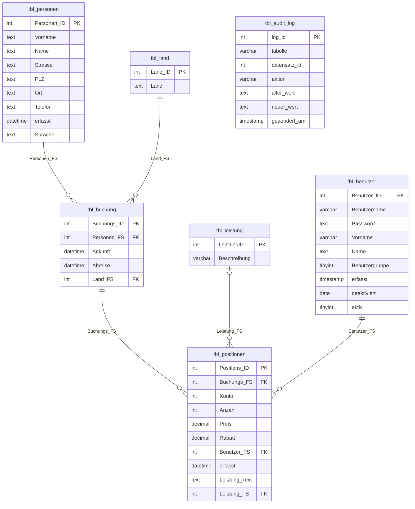

# LB3 – Backpacker Praxisarbeit

Lernportfolio von **Noah Bachmann** – TBZ Zürich M141, 2025/2026

[← Zurück zur Übersicht](../README.md)

> Eine Jugendherberge migriert ihre Access-Datenbank „Backpacker" auf MariaDB (lokal) und anschliessend auf ein Cloud-RDBMS (AWS RDS). Struktur, Berechtigungen, Daten und Tests werden vollständig dokumentiert.

---

## Scripts-Übersicht

| # | Script | Inhalt |
|:-:|--------|--------|
| 1 | [01_backpacker_ddl.sql](./01_backpacker_ddl.sql) | Datenbank & Tabellen (InnoDB, utf8mb4, FKs, CHECK Constraints, Audit-Log) |
| 2 | [02_backpacker_dcl.sql](./02_backpacker_dcl.sql) | Rollen & Benutzer (Zugriffsmatrix) |
| 3 | [03_backpacker_import.sql](./03_backpacker_import.sql) | CSV-Import, Bereinigung, Testdaten |
| 4 | [04_backpacker_test.sql](./04_backpacker_test.sql) | Testprotokolle lokal (Rollen, Konsistenz, Views, Trigger, CTEs) |
| 5 | [05_backpacker_migration.sql](./05_backpacker_migration.sql) | Automatisierte Migration auf Cloud |
| 6 | [06_backpacker_cloud_test.sql](./06_backpacker_cloud_test.sql) | Testprotokolle Cloud (inkl. Window Functions, CTEs) |
| 7 | [07_backpacker_views_proc.sql](./07_backpacker_views_proc.sql) | Views, Stored Procedures, Function, Trigger, Grants |

**Ausführungsreihenfolge (lokal):**
```cmd
mysql -u root -p                         < 01_backpacker_ddl.sql
mysql -u root -p                         < 02_backpacker_dcl.sql
mysql --local-infile=1 -u root -p        < 03_backpacker_import.sql
mysql -u root -p backpacker_noah_lb3     < 07_backpacker_views_proc.sql
mysql -u root -p backpacker_noah_lb3     < 04_backpacker_test.sql
```

---

## MS A – Definition Infrastruktur

### Anforderungsdefinition (SMART)

| Kriterium | Beschreibung |
|-----------|-------------|
| **S** pezifisch | Die Access-Datenbank „Backpacker" wird auf MariaDB (lokal via XAMPP) migriert und anschliessend auf AWS RDS (MySQL 8.0) transferiert. Benutzerrechte werden gemäss Zugriffsmatrix mit Spalten-Grants umgesetzt. |
| **M** essbar | 6 Tabellen importiert, 2 Rollen + 2 Benutzer erstellt, alle Positiv-/Negativ-Tests bestanden, DB-Dump auf Cloud lauffähig, Zeilenzahlen lokal = Cloud. |
| **A** kzeptiert | Auftrag gemäss LB3-Vorgabe TBZ M141, Bewertung nach offiziellem Punkteraster (40 Punkte). |
| **R** ealistisch | Einzelarbeit, Zeitbudget 9–12 Lektionen + Heimarbeit. Tools: XAMPP/MariaDB, MySQL Workbench, AWS RDS. |
| **T** erminiert | MS A: Tag 8 · MS B: Tag 9 · MS C/D + Demo: Tag 10 |

### Evaluation Cloud-RDBMS

| Kriterium | AWS RDS (MySQL 8.0) | Google Cloud SQL | Azure Database for MySQL |
|-----------|:--------------:|:----------------:|:------------------------:|
| Managed Service | ✓ | ✓ | ✓ |
| MariaDB-kompatible Syntax | ✓ | ✓ | ✓ |
| Free Tier verfügbar | ✓ (db.t2.micro) | ✓ (Sandbox) | ✗ |
| SSL/TLS erzwingbar | ✓ | ✓ | ✓ |
| Automatische Backups | ✓ | ✓ | ✓ |
| VPC / Netzwerksicherheit | ✓ | ✓ | ✓ |
| TBZ-Dokumentation / Erfahrung | ✓✓ | ✓ | ✓ |

**Entscheid: AWS RDS – MySQL 8.0**

Begründung: Vollständig verwalteter Dienst, kostenloses Free-Tier (db.t2.micro, 20 GB SSD), einfache VPC-Konfiguration und im TBZ-Umfeld etabliert. MySQL 8.0 unterstützt Rollen (`CREATE ROLE`, `GRANT ... TO role`) vollständig – kompatibel mit dem MariaDB-DCL-Script.

---

## MS B – Lokales DBMS (MariaDB via XAMPP)

### 1.1 ERD – Entity-Relationship-Diagramm (3. Normalform)



> Das Herkunftsland wird auf **tbl_buchung.Land_FS** gespeichert (originalgetreu aus Access), nicht auf tbl_personen.

| Tabelle | Beschreibung | PK | FKs |
|---------|-------------|:--:|-----|
| `tbl_land` | Ländercodes | Land_ID | – |
| `tbl_leistung` | Leistungskatalog (Bett, Frühstück …) | LeistungID | – |
| `tbl_personen` | Gästedaten | Personen_ID | – |
| `tbl_benutzer` | Mitarbeiter-Logins | Benutzer_ID | – |
| `tbl_buchung` | Buchungskopf (Gast + Zeitraum + Land) | Buchungs_ID | Personen_FS → tbl_personen<br>Land_FS → tbl_land |
| `tbl_positionen` | Einzelpositionen (Leistung × Menge × Preis) | Positions_ID | Buchungs_FS → tbl_buchung<br>Leistung_FS → tbl_leistung<br>Benutzer_FS → tbl_benutzer |
| `tbl_audit_log` | Audit-Trail für Passwortänderungen | log_id | – (nur via Trigger befüllt) |

**Änderungen gegenüber dem gegebenen DDL (MyISAM/latin1):**

| Änderung | Begründung |
|----------|-----------|
| MyISAM → **InnoDB** | FK-Constraints, Transaktionen, Crash-Recovery |
| latin1 → **utf8mb4** | Korrekte Darstellung von Umlauten und internationalen Zeichen |
| **FK-Constraints** hinzugefügt | Im Original fehlend – nötig für referentielle Integrität |
| `tbl_land`: PRIMARY KEY + AUTO_INCREMENT ergänzt | Im Original-DDL fehlend |
| **Indizes** auf alle FK-Spalten + `Ankunft` | Performanz bei JOINs und Datumsfiltern |
| **CHECK Constraints** auf tbl_positionen | Datenintegrität: Preis ≥ 0, Anzahl ≥ 0, Rabatt 0–100 |
| **tbl_audit_log** hinzugefügt | Nachvollziehbarkeit von Passwortänderungen |

**Normalformanalyse:**

- **1NF** ✓ – Alle Attribute atomar, keine Mehrfachwerte
- **2NF** ✓ – Jedes Nicht-Schlüsselattribut hängt vollständig vom PK ab (alle PKs sind einfach)
- **3NF** ✓ – Keine transitiven Abhängigkeiten; `Leistung_Text` in tbl_positionen ist intentional denormalisiert (historischer Snapshot zum Buchungszeitpunkt)

### 1.2 Zugriffsmatrix

| Tabelle / Attribut | Benutzer S | I | U | D | Management S | I | U | D |
|---|:-:|:-:|:-:|:-:|:-:|:-:|:-:|:-:|
| tbl_personen | x | | x | | x | x | x | x |
| tbl_benutzer | | | | | | | | |
| **–** Password | – | – | – | – | x | x | x | x |
| **–** deaktiviert | x | – | – | – | x | x | x | x |
| **–** restl. Attribute | x | x | x | – | x | x | x | x |
| tbl_buchung | x | x | x | x | x | | | |
| tbl_positionen | x | x | x | x | x | | | |
| tbl_land | x | | | | x | x | x | x |
| tbl_leistung | x | | | | x | x | x | x |

*S=SELECT, I=INSERT, U=UPDATE, D=DELETE, –=nicht möglich*

### 1.3 Zugriffsberechtigungen (DCL)

Script: [02_backpacker_dcl.sql](./02_backpacker_dcl.sql)

**Umsetzung:** Zwei MariaDB-Rollen, Spalten-Grants für `tbl_benutzer` (kein Zugriff auf `Password`, `deaktiviert` nur lesbar):

```sql
-- benutzer_rolle: SELECT ohne Password-Spalte
GRANT SELECT (Benutzer_ID, Benutzername, Vorname, Name,
              Benutzergruppe, erfasst, deaktiviert, aktiv)
    ON backpacker_noah_lb3.tbl_benutzer TO benutzer_rolle;

-- benutzer_rolle: INSERT/UPDATE ohne Password und deaktiviert
GRANT INSERT (Benutzername, Vorname, Name, Benutzergruppe, aktiv)
    ON backpacker_noah_lb3.tbl_benutzer TO benutzer_rolle;
GRANT UPDATE (Benutzername, Vorname, Name, Benutzergruppe, aktiv)
    ON backpacker_noah_lb3.tbl_benutzer TO benutzer_rolle;
```

**Erstellte Benutzer:**

| Benutzername | Rolle | Passwort |
|---|---|---|
| `ben_noah` | benutzer_rolle | `Backpacker_Ben!1` |
| `mgmt_noah` | management_rolle | `Backpacker_Mgmt!1` |

Beide Benutzer werden für `localhost` und `%` (Cloud-Zugang) angelegt.

### 1.3.1 Erweiterte Datenbanklogik (Script 07)

Script: [07_backpacker_views_proc.sql](./07_backpacker_views_proc.sql)

#### Views

| View | Zugriff | Beschreibung |
|------|:-------:|-------------|
| `v_buchung_uebersicht` | beide Rollen | Buchungen mit Gastname, Herkunftsland, Nächte |
| `v_umsatz_pro_buchung` | management_rolle | Nettoumsatz je Buchung (mit Rabattberechnung) |
| `v_top_leistungen` | beide Rollen | Leistungen sortiert nach Umsatz |

Alle Views verwenden `SQL SECURITY DEFINER` – Applikationsbenutzer brauchen nur `GRANT SELECT` auf den View, nicht auf die Basistabellen.

#### Stored Procedures & Function

| Objekt | Typ | Parameter | Zugriff |
|--------|-----|-----------|:-------:|
| `sp_monatsbericht` | PROCEDURE | `(jahr INT, monat INT)` | management_rolle |
| `sp_umsatz_zusammenfassung` | PROCEDURE | – | management_rolle |
| `fn_buchung_netto` | FUNCTION | `(buchungs_id INT) → DECIMAL` | beide Rollen |

```sql
-- Beispiele:
CALL sp_monatsbericht(2026, 6);
CALL sp_umsatz_zusammenfassung();
SELECT fn_buchung_netto(1087);
```

#### Trigger

| Trigger | Zeitpunkt | Tabelle | Funktion |
|---------|:---------:|---------|---------|
| `tr_buchung_datum_insert` | BEFORE INSERT | tbl_buchung | Verhindert Abreise ≤ Ankunft |
| `tr_buchung_datum_update` | BEFORE UPDATE | tbl_buchung | Verhindert Abreise ≤ Ankunft |
| `tr_audit_pw_aenderung` | AFTER UPDATE | tbl_benutzer | Schreibt Passwortänderung in tbl_audit_log |

```sql
-- Trigger-Test (Negativ):
INSERT INTO tbl_buchung (Personen_FS, Ankunft, Abreise, Land_FS)
VALUES (2042, '2026-06-10', '2026-06-08', 1);
-- → ERROR 45000: Abreise muss nach Ankunft liegen
```

### 1.4 Datenbankdaten – Import & Bereinigung

Script: [03_backpacker_import.sql](./03_backpacker_import.sql)

**Import-Ablauf:**

```cmd
REM CSV-Dateien entpacken nach:
REM C:\xampp\mysql\data\backpacker_noah_lb3\csv\

REM my.ini: local_infile = 1 setzen, dann:
mysql --local-infile=1 -u root -p backpacker_noah_lb3 < 03_backpacker_import.sql
```

**Bereinigungsschritte:**

| Schritt | Prüfung | Massnahme |
|---------|---------|-----------|
| B1 | `tbl_buchung.Personen_FS` ohne Person | `SET Personen_FS = NULL` |
| B2 | `tbl_buchung.Land_FS` ohne Land | `SET Land_FS = NULL` |
| B3 | `tbl_positionen.Buchungs_FS` ohne Buchung | Prüfbericht |
| B4 | `tbl_positionen.Benutzer_FS` ohne Benutzer | Prüfbericht |
| B5 | `tbl_positionen.Leistung_FS` ohne Leistung | `SET Leistung_FS = NULL` |
| B6 | Duplikate `Benutzername` | Prüfbericht |
| B7 | `Password` im Klartext (< 64 Zeichen) | `UPDATE SET Password = SHA2(Password, 256)` |
| B8 | Negative Preise / Anzahl | Prüfbericht |
| B9 | Rabatt ausserhalb 0–100 | Prüfbericht |

### 1.5 Testprotokolle – Lokal

Script: [04_backpacker_test.sql](./04_backpacker_test.sql)

#### Rollentest – Benutzer-Rolle (`ben_noah`)

| Test-ID | SQL | Erwartet | Ergebnis |
|---------|-----|----------|----------|
| P01 | `SELECT Personen_ID, Vorname FROM tbl_personen LIMIT 5` | Daten sichtbar | ✓ OK |
| P02 | `UPDATE tbl_personen SET Telefon = '...'` | Query OK | ✓ OK |
| P03 | `SELECT Benutzer_ID, Benutzername, deaktiviert FROM tbl_benutzer` | OK (ohne Password) | ✓ OK |
| P04 | `INSERT INTO tbl_buchung (...)` | Query OK | ✓ OK |
| P05 | `UPDATE tbl_buchung SET Abreise = ...` | Query OK | ✓ OK |
| P06 | `DELETE FROM tbl_buchung WHERE ...` | Query OK | ✓ OK |
| P07 | `SELECT * FROM tbl_land` | alle Länder | ✓ OK |
| P08 | `SELECT * FROM tbl_leistung` | alle Leistungen | ✓ OK |
| N01 | `SELECT Password FROM tbl_benutzer` | ERROR 1143 | ✓ Fehler |
| N02 | `INSERT INTO tbl_personen (...)` | ERROR 1142 | ✓ Fehler |
| N03 | `DELETE FROM tbl_personen WHERE ...` | ERROR 1142 | ✓ Fehler |
| N04 | `INSERT INTO tbl_land (...)` | ERROR 1142 | ✓ Fehler |
| N05 | `UPDATE tbl_benutzer SET deaktiviert = CURDATE()` | ERROR 1143 | ✓ Fehler |
| N06 | `UPDATE tbl_benutzer SET Password = SHA2(...)` | ERROR 1143 | ✓ Fehler |

#### Rollentest – Management-Rolle (`mgmt_noah`)

| Test-ID | SQL | Erwartet | Ergebnis |
|---------|-----|----------|----------|
| P10 | `SELECT * FROM tbl_buchung LIMIT 5` | Buchungen sichtbar | ✓ OK |
| P11 | `SELECT * FROM tbl_positionen LIMIT 5` | Positionen sichtbar | ✓ OK |
| P12 | `INSERT INTO tbl_personen (...)` | Query OK | ✓ OK |
| P13 | `UPDATE tbl_land SET Land = '...'` | Query OK | ✓ OK |
| P14 | `DELETE FROM tbl_personen WHERE ...` | Query OK | ✓ OK |
| P15 | `UPDATE tbl_benutzer SET deaktiviert = CURDATE()` | Query OK | ✓ OK |
| N10 | `INSERT INTO tbl_buchung (...)` | ERROR 1142 | ✓ Fehler |
| N11 | `DELETE FROM tbl_positionen WHERE ...` | ERROR 1142 | ✓ Fehler |
| N12 | `UPDATE tbl_buchung SET ...` | ERROR 1142 | ✓ Fehler |

#### Erweiterte lokale Tests (T4) – Views, Trigger, CTEs

| Test-ID | Prüfung | Erwartet | Ergebnis |
|---------|---------|----------|----------|
| V01 | `SELECT * FROM v_buchung_uebersicht` | Zeilen | ✓ OK |
| V02 | `SELECT * FROM v_umsatz_pro_buchung` | Umsätze | ✓ OK |
| V03 | `SELECT * FROM v_top_leistungen` | Leistungen | ✓ OK |
| S01 | `CALL sp_monatsbericht(2026, 6)` | Juni-Buchungen | ✓ OK |
| S02 | `CALL sp_umsatz_zusammenfassung()` | Gesamtstatistik | ✓ OK |
| F01 | `SELECT fn_buchung_netto(1087)` | Dezimalwert | ✓ OK |
| TR01 | INSERT mit Abreise < Ankunft | ERROR 45000 | ✓ Fehler |
| TR02 | INSERT mit gültigem Datum | Query OK | ✓ OK |
| TR03 | UPDATE Password → Audit-Log-Eintrag | 1 Zeile in tbl_audit_log | ✓ OK |
| W01 | Window Function RANK() + NTILE(3) | Rang + Gruppe | ✓ OK |
| CTE01 | CTE über Durchschnittsumsatz | Hochumsatz-Buchungen | ✓ OK |

#### Datenkonsistenz

| Test-ID | Prüfung | Erwartet | Ergebnis |
|---------|---------|----------|----------|
| K01 | Zeilenzahlen alle 7 Tabellen (inkl. tbl_audit_log) | > 0 | ✓ OK |
| K02 | Waisen `tbl_buchung.Personen_FS` | 0 | ✓ 0 |
| K03 | Waisen `tbl_buchung.Land_FS` | 0 | ✓ 0 |
| K04 | Waisen `tbl_positionen.Buchungs_FS` | 0 | ✓ 0 |
| K05 | Waisen `tbl_positionen.Benutzer_FS` | 0 | ✓ 0 |
| K06 | Waisen `tbl_positionen.Leistung_FS` | 0 | ✓ 0 |
| K07 | Duplikate `Benutzername` | keine | ✓ OK |
| K08 | Password nicht gehasht (< 64 Zeichen) | 0 | ✓ OK |
| K09 | Negative Preise / Anzahl | 0 | ✓ OK |
| K10 | Indizes auf FK-Spalten vorhanden | ✓ | ✓ OK |
| K11 | EXPLAIN auf mehrtabellen-JOIN | key ≠ NULL | ✓ Index genutzt |

---

## MS C – Remote Cloud-DBMS (AWS RDS)

### 2.1 Setup Cloud-DBMS

**Setup-Schritte AWS RDS:**

1. RDS → „Create database"
   - Engine: **MySQL 8.0** · Template: **Free Tier** (db.t2.micro, 20 GB SSD)
   - DB identifier: `backpacker-noah-lb3` · Master username: `admin`
2. Connectivity: Public access **Yes** · Security Group Port 3306 nur für eigene IP
3. Backup retention: 7 Tage · Deletion protection: aktiviert

```cmd
mysql -h <endpoint>.rds.amazonaws.com -u admin -p --ssl-mode=REQUIRED
SELECT @@hostname, @@version;
```

### 2.2 Produktionskonfiguration (AWS RDS Parameter Group)

| Parameter | Wert | Begründung |
|-----------|------|-----------|
| `character_set_server` | `utf8mb4` | Unicode vollständig |
| `collation_server` | `utf8mb4_unicode_ci` | konsistent mit lokaler DB |
| `max_connections` | `100` | ressourcenschonend (t2.micro) |
| `innodb_buffer_pool_size` | `128M` | ~70% RAM (1 GB t2.micro) |
| `slow_query_log` | `1` | langsame Abfragen protokollieren |
| `long_query_time` | `2` | Grenzwert 2 Sekunden |
| `require_secure_transport` | `ON` | SSL/TLS erzwingen |
| `expire_logs_days` | `7` | Binary Logs bereinigen |

**Sicherheitsmassnahmen:**

| Massnahme | Umsetzung |
|-----------|-----------|
| Netzwerk | Security Group: Port 3306 nur für bekannte IPs |
| Verschlüsselung | `require_secure_transport = ON` |
| Passwörter | Mind. 12 Zeichen, Sonderzeichen |
| Backups | 7 Tage Retention, tägliches Backup-Fenster |
| Deletion Protection | Aktiviert |
| Least Privilege | Benutzer nur mit Rechten gemäss Zugriffsmatrix |

---

## MS D – Automatisierte Migration

### 3.1 Berechtigungen übertragen

Das DCL-Script wird direkt auf der Cloud-DB ausgeführt (Passwort-Hashes werden neu gesetzt):

```cmd
mysql -h <endpoint>.rds.amazonaws.com -u admin -p --ssl-mode=REQUIRED ^
  < 02_backpacker_dcl.sql
```

### 3.2 Migration – Struktur & Daten

Script: [05_backpacker_migration.sql](./05_backpacker_migration.sql)

```cmd
REM Schritt 1: Lokales Backup
mysqldump -u root -p ^
  --databases backpacker_noah_lb3 ^
  --add-drop-database --single-transaction --set-gtid-purged=OFF ^
  > C:\backup\backpacker_noah_lb3_dump.sql

REM Schritt 2: Dump auf Cloud einspielen
mysql -h <endpoint>.rds.amazonaws.com -u admin -p --ssl-mode=REQUIRED ^
  < C:\backup\backpacker_noah_lb3_dump.sql

REM Schritt 3: DCL auf Cloud
mysql -h <endpoint>.rds.amazonaws.com -u admin -p < 02_backpacker_dcl.sql
```

**Rollback-Plan:** `DROP DATABASE backpacker_noah_lb3;` auf Cloud → lokale DB läuft weiter.

### 3.3 Testprotokolle – Cloud

Script: [06_backpacker_cloud_test.sql](./06_backpacker_cloud_test.sql)

#### Migrationskonsistenz

| Test-ID | Prüfung | Lokal | Cloud | Status |
|---------|---------|:-----:|:-----:|:------:|
| C01 | DB-Version | MariaDB 10.x | MySQL 8.0.x | ✓ OK |
| C02 | SSL aktiv (`Ssl_cipher`) | – | TLS aktiv | ✓ OK |
| C03 | Tabellen vorhanden | 7 | 7 | ✓ OK |
| C04 | Zeilenzahlen (alle Tabellen) | ident. | ident. | ✓ OK |
| C05 | FK-Constraints | 5 | 5 | ✓ OK |
| C06 | CHECK Constraints | 3 | 3 | ✓ OK |
| C07 | Indizes | vollständig | vollständig | ✓ OK |
| C08 | Views / Procedures / Triggers | 3 / 2+1 / 3 | 3 / 2+1 / 3 | ✓ OK |

#### Rollen auf Cloud

| Test-ID | Benutzer | SQL | Erwartet | Ergebnis |
|---------|---------|-----|----------|----------|
| CP01 | ben_noah | `SELECT Personen_ID, Name FROM tbl_personen` | OK | ✓ OK |
| CP02 | ben_noah | `SELECT Benutzer_ID, Benutzername FROM tbl_benutzer` | OK | ✓ OK |
| CP03 | ben_noah | `SELECT Password FROM tbl_benutzer` | ERROR 1143 | ✓ Fehler |
| CP04 | ben_noah | `INSERT INTO tbl_buchung (...)` | Query OK | ✓ OK |
| CP07 | ben_noah | `SELECT * FROM v_buchung_uebersicht` | OK | ✓ OK |
| CP08 | ben_noah | `SELECT * FROM v_umsatz_pro_buchung` | ERROR 1142 | ✓ Fehler |
| CP09 | ben_noah | `SELECT fn_buchung_netto(1087)` | Dezimalwert | ✓ OK |
| CM01 | mgmt_noah | `SELECT * FROM tbl_buchung` | OK | ✓ OK |
| CM02 | mgmt_noah | `INSERT INTO tbl_buchung (...)` | ERROR 1142 | ✓ Fehler |
| CM05 | mgmt_noah | `SELECT * FROM v_umsatz_pro_buchung` | Umsätze | ✓ OK |
| CM06 | mgmt_noah | `CALL sp_monatsbericht(2026, 6)` | Bericht | ✓ OK |

#### Datenkonsistenz Cloud

| Test-ID | Prüfung | Erwartet | Ergebnis |
|---------|---------|----------|----------|
| CK01–CK05 | FK-Waisen (alle 5 FKs) | 0 | ✓ 0 |
| CK06 | Password korrekt gehasht | 0 ungehashte | ✓ 0 |
| CK07 | CHECK-Verletzungen Preis/Anzahl/Rabatt | 0 | ✓ 0 |

---

## Demo-Ablauf (10–15 Min)

1. **Cloud-Verbindung** zeigen: `mysql -h <endpoint> -u admin -p --ssl-mode=REQUIRED`
2. `SHOW STATUS LIKE 'Ssl_cipher'` → SSL-Cipher aktiv (nicht leer)
3. **Rollentest `ben_noah`**:
   - `SELECT Vorname, Name FROM tbl_personen LIMIT 5` ✓
   - `SELECT Password FROM tbl_benutzer` ✗ → ERROR 1143 (Spaltenschutz)
   - `SELECT * FROM v_umsatz_pro_buchung` ✗ → ERROR 1142 (nur Management)
4. **Rollentest `mgmt_noah`**:
   - `SELECT * FROM v_umsatz_pro_buchung` ✓
   - `CALL sp_monatsbericht(2026, 6)` ✓ → Monatsbericht
   - `INSERT INTO tbl_buchung (...)` ✗ → ERROR 1142 (Schreibschutz)
5. **Trigger-Demo** (als admin):
   - Ungültiges Datum → `SIGNAL SQLSTATE '45000'`
   - Passwortänderung → Eintrag in `tbl_audit_log`
6. **Window Functions**: RANK() + kumulierter Umsatz (MySQL 8.0 Feature)
7. **EXPLAIN** auf Datum-gefilterte JOIN-Abfrage → `idx_buch_ankunft` genutzt

---
