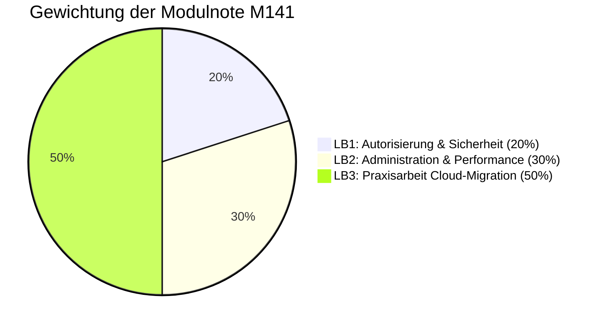

# M141 – Datenbanksystem in Betrieb nehmen

Lernportfolio und Leistungsnachweise von **Noah Bachmann**  
*TBZ Technische Berufsschule Zürich, Schuljahr 2025/2026*

> **Modulbeschrieb:**
> Dieses Modul umfasst die Installation, Konfiguration und Absicherung eines relationalen Datenbanksystems (RDBMS). Es beinhaltet die Dateninitialisierung, funktionale Tests zur Qualitätssicherung (Performance- & Integritäts-Benchmarks) sowie die schlüsselfertige Übergabe einer On-Premise-Datenbank in eine verwaltete Cloud-Infrastruktur (AWS RDS).

---

## 📅 Lektionenplan & Lernjournal

Die Ausbildung ist in wöchentliche Lektionstage gegliedert. Jedes Verzeichnis enthält die theoretischen Grundlagen, Praxishandbücher und Checkpoint-Prüfungen des jeweiligen Themas:

| Tag | Thema | Fokus-Inhalte | Leistungsbeurteilung |
|:---:|-------|---------------|:--------------------:|
| 📘 **[Tag 1](1.Tag/README.md)** | Intro & Installation | Client/Server-Modell, RDBMS vs. NoSQL, XAMPP, MariaDB-Dienststeuerung | |
| 📘 **[Tag 2](2.Tag/README.md)** | Konfiguration & Import | `my.ini` Parameter, Zeichensätze (`utf8mb4`), DDL vs. DML, Massen-Imports | |
| 📘 **[Tag 3](3.Tag/README.md)** | Engines & Transaktionen | MyISAM vs. InnoDB, ACID-Prinzip, Row/Table-Locking, Deadlocks | |
| 📘 **[Tag 4](4.Tag/README.md)** | Datenbanksicherheit | Authentifizierungs-Plugins, IP-Sicherheitsbarrieren, Netzwerk-Lockdown | |
| 📘 **[Tag 5](5.Tag/README.md)** | Zugriffssystem | Autorisierung, DCL (`GRANT`/`REVOKE`), Spalten-Grants, Rollenverwaltung | **LB1 · 20 %** |
| 📘 **[Tag 6](6.Tag/README.md)** | Server Administration | Log-Typen, Point-in-Time-Recovery (PITR), B-Tree-Indizes, `EXPLAIN` | |
| 📘 **[Tag 7](7.Tag/README.md)** | Qualitätssicherung | Bulk-Import Tuning, Daten-Deduplizierung, `mysqlslap` Benchmarks | **LB2 · 30 %** |
| 🚀 **[LB3](LB3/README.md)** | Backpacker Praxisarbeit | Migration MS Access $\rightarrow$ MariaDB $\rightarrow$ AWS RDS, Views, Trigger | **LB3 · 50 %** |

---

## 🏆 Leistungsbeurteilungen (Übersicht)

Die Modulnote setzt sich aus drei gewichteten Leistungsbeurteilungen (LB) zusammen:

| Leistungsbeurteilung | Gewichtung | Prüfungsstoff & Kriterien |
|----------------------|:----------:|---------------------------|
| **LB1** | **20 %** | Theorie und Praxis zu Zugriffsrechten, Authentifizierung und Benutzerverwaltung (Tag 1–4).
| **LB2** | **30 %** | Praxisprüfung zur Server-Administration, Performance-Optimierung und Backup/Recovery (Tag 1–7). 
| **LB3** | **50 %** | Selbstständige Praxisarbeit: Vollständige Migration der Datenbank „Backpacker" auf AWS RDS, inklusive SQL-Programmierung (Views, Trigger, Stored Procedures).

---

## 🛠️ Verwendete Werkzeuge (Tool-Stack)

Für die Übungen und die Praxisarbeit kommt folgender Software-Stack zum Einsatz:

### Server-Komponenten
*   **MariaDB / MySQL Daemon (`mysqld`)**: Die relationale Core-Engine des Datenbanksystems.
*   **XAMPP**: Lokale Entwicklungsumgebung (Apache-Webserver + MariaDB-Server).
*   **AWS RDS (MySQL 8.0)**: Verwaltetes Cloud-RDBMS für die produktive Bereitstellung.

### Client-Programme & Administration
*   **MySQL Workbench**: Offizielles Administrations- und Modellierungswerkzeug.
*   **phpMyAdmin**: Webbasiertes Administrations-Interface (erreichbar über `http://localhost/phpmyadmin`).
*   **MySQL CLI (`mysql`)**: Interaktiver Kommandozeilen-Client für Skriptausführungen.
*   **`mysqldump`**: CLI-Tool zur Erstellung logischer Datenbank-Backups (SQL-Dumps).
*   **`mysqlslap`**: Benchmark-Client zur Simulation gleichzeitiger Lastzugriffe.
